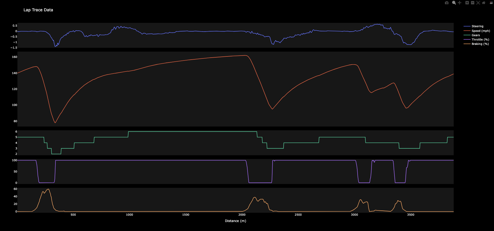

# Lap Trace Plot

This project provides a simple lap trace plot for a racing driver on a qualifying lap. The chart visualizes the driver's steering, gearshifts, throttle, braking, and speed throughout the lap.

## Features

- **Steering**: Displays the steering input of the driver.
- **Gearshifts**: Shows the gear changes during the lap.
- **Throttle**: Visualizes the throttle application.
- **Braking**: Indicates the braking points.
- **Speed**: Plots the speed of the car throughout the lap.

## Installation

To install the necessary dependencies, run:

```bash
pip install -r requirements.txt
```

## Usage

To generate the lap trace plot, run the following command:

```bash
python lap_trace.py
```

## Example



## Contributing

Contributions are welcome! Please open an issue or submit a pull request.

## License

This project is licensed under the MIT License.

## Contact

For any questions or suggestions, please contact [Tom Shaw](mailto:tom@tomshaw.dev)
